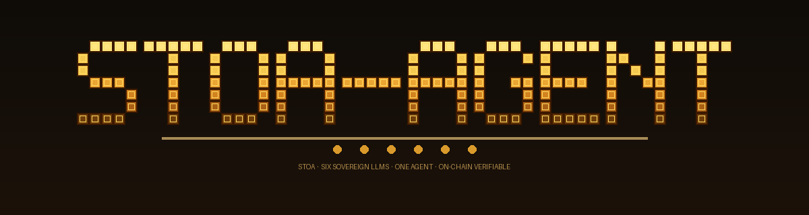

<p align="center">
  
</p>

# STOA Agent ⁂

**Six sovereign LLMs as your local agent.**
Council-mode by default · On-chain verifiable · ERC-8004 reputation.

> *Hermes Agent gave you one brain on your machine. STOA gives you a chamber.*

A fork of [NousResearch / hermes-agent](https://github.com/NousResearch/hermes-agent) v0.14.0 (MIT) — see [ATTRIBUTION.md](ATTRIBUTION.md) for the full provenance.

---

## Install

**macOS · Linux · WSL2 · Termux**
```sh
curl -fsSL https://stoax.xyz/install.sh | sh
```

**Windows · PowerShell**
```powershell
iex (irm https://stoax.xyz/install.ps1)
```

**Direct from source**
```sh
git clone https://github.com/STOAGENT/stoa-agent
cd stoa-agent
uv venv && uv pip install -e .
stoa setup
```

---

## What's different from Hermes

The STOA fork preserves everything Hermes did right — the agent runtime, the 21-platform gateway, the 7-backend sandbox, the SQLite + FTS5 memory, the SKILL.md format, the uv-based one-line install — and adds the things a single-brain framework cannot:

### 1. Council mode (5-of-6 quorum)

Hermes routes a task to one LLM. STOA routes it to six (one per sovereign provider) in parallel, then a seventh dispatcher (Hermes-the-character) composes a verdict. Five of six must agree on the core position. Dissent is captured, not erased.

```sh
stoa /council "audit this contract: $(cat MyToken.sol)"
# → 6 LLMs in parallel
# → Sokrates / Mira / Veritas / Drax / Lyra / Echo each respond
# → Verdict + agreement signal + per-agent dissent + response hash
```

### 2. On-chain attestation

Every tool call optionally writes its response hash to **AuditAttestationV2** on Monad mainnet. Months later, anyone can verify a STOA agent ran exactly the action it claims it ran — without trusting the operator.

```sh
stoa --attest /council "verify this trade"
# → tx hash returned, IPFS evidence bundle pinned
```

### 3. ERC-8004 agent reputation

Each command emits a reputation event. The cross-agent reputation graph (queryable on-chain) lets other agents check a STOA agent's track record before delegating to it.

### 4. Council-audited skill publication

The hardest problem in agent skill ecosystems is supply-chain trust — OpenClaw shipped 9 CVEs in 4 days. STOA's answer: **no skill publishes without a 6-agent audit + 5-of-6 quorum + an on-chain audit hash**. Security, performance, prompt-injection, license, structure, attribution — six different lenses on every new skill.

### 5. Persona-bound provider routing

The six agents are not six instances of the same model. Each is tied to a different sovereign provider:

| Agent | Role | Marketing name |
|---|---|---|
| Sokrates | the question-maker | Claude Opus 4.7 |
| Mira | the builder | GPT-5 |
| Veritas | the auditor | Gemini 2.5 Pro |
| Drax | the red team | Grok 4 |
| Lyra | the designer | Llama 3.3 405B |
| Echo | the operator | Mistral Large 3 |
| Hermes | the dispatcher (the seventh) | — |

Set them per persona in `~/.stoa/cli-config.yaml`:

```yaml
personas:
  sokrates: { provider: anthropic, model: claude-opus-4-7,  api_mode: anthropic }
  mira:     { provider: openrouter, model: openai/gpt-5,     api_mode: chat_completions }
  veritas:  { provider: openrouter, model: google/gemini-2.5-pro }
  drax:     { provider: openrouter, model: xai/grok-4 }
  lyra:     { provider: openrouter, model: meta-llama/llama-3.3-405b }
  echo:     { provider: openrouter, model: mistralai/mistral-large-3 }
  hermes:   { provider: deepseek,  model: deepseek-chat }
```

### 6. Council mode + on-chain attestation

Solo mode, all 21 platforms, and the full skill ecosystem are free. Council mode + opt-in on-chain attestation are available to anyone in v0.x — the token gate is disabled by default (no STOA token deployed yet; the launch was cancelled).

When/if a STOA token launches, the gate activates by setting `STOA_TOKEN_CONTRACT` + `STOA_COUNCIL_MIN_HOLDING_WEI` in env. Until then, council mode is free.

```sh
# Bind your wallet (requires signing the canonical EIP-4361 bind message
# — see `stoa wallet message` for the exact string).
stoa wallet bind 0x... --signature 0x...

# Use council mode.
stoa /council "..."
```

> ⚠️ **On-chain attestation status**: the `attest_response_hash` codepath
> is a SCAFFOLD in v0.x — it computes the response hash + persists it
> locally but does not yet submit a transaction to the
> `AuditAttestationV2` contract on Monad mainnet. The M3 release wires
> the actual `eth_sendRawTransaction` transport. Until then, expect
> `attestation_enabled` to log "scaffold" + queue the request.

---

## Commands (Hermes-compatible)

| Command | What it does |
|---|---|
| `stoa` | Splash dashboard + interactive REPL (Hermes parity) |
| `stoa chat` | Direct chat mode |
| `stoa setup` | First-run wizard |
| `stoa gateway` | Run the multi-platform daemon |
| `stoa hermes migrate` | **Auto-port** your Hermes settings, skills, memories, and API keys |
| `stoa /council "<task>"` | **NEW** — six LLMs in parallel + verdict |
| `stoa /persona <name>` | **NEW** — switch single-mode agent |
| `stoa /attest` | **NEW** — stamp the last response on-chain |
| `stoa /verdict` | **NEW** — show the last council verdict |
| `stoa skill publish` | **CHANGED** — runs the 6-agent audit gate before publishing |

---

## Skills shipped under `skills/stoa/`

- `council-verdict` — orchestrate a 6-LLM call from inside a skill
- `monad-attestation` — write a hash to AuditAttestationV2
- `solidity-audit-pipeline` — Slither + Mythril + Echidna + manual review
- `erc8004-reputation` — read or write agent reputation events
- `stoa-skill-publish` — the publication audit gate itself
- `monad-mev-watchdog` — passive on-chain monitor
- `solana-anchor-audit` — Anchor-program review

---

## License

MIT. See [LICENSE](LICENSE). The original Hermes Agent license is preserved unchanged; this fork adds [ATTRIBUTION.md](ATTRIBUTION.md).

## Links

- Docs · https://stoax.xyz/cli
- Chamber · https://stoax.xyz
- Token · [STOA on nad.fun](https://nad.fun/tokens/0xd645C10050551E93e40c4C06aF4b24F790067777)
- Source · https://github.com/STOAGENT/stoa-agent
- Upstream · https://github.com/NousResearch/hermes-agent
